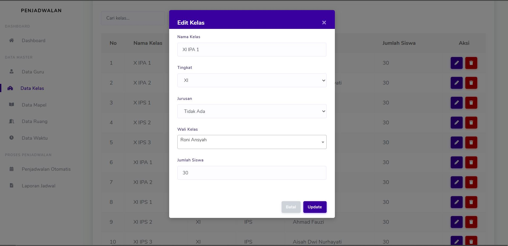
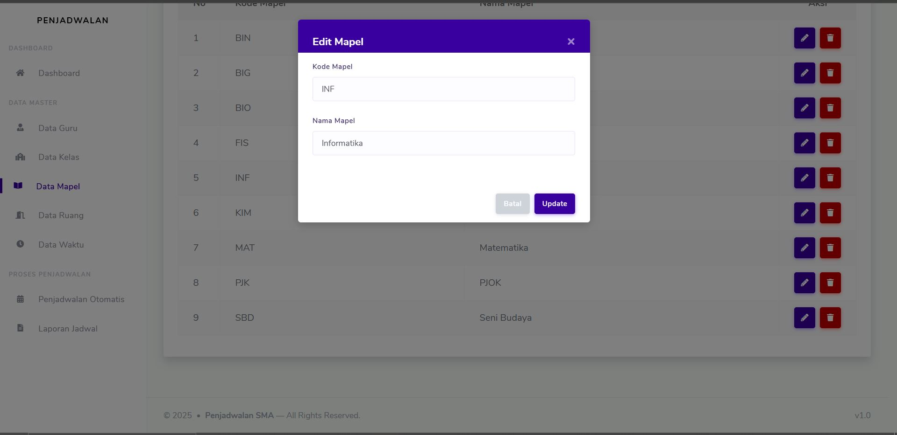
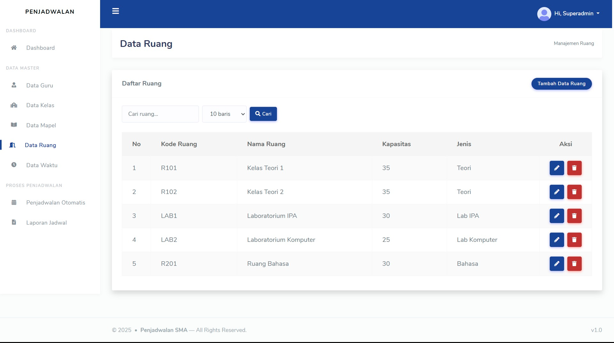
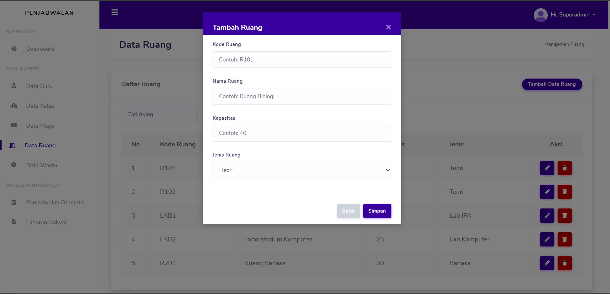
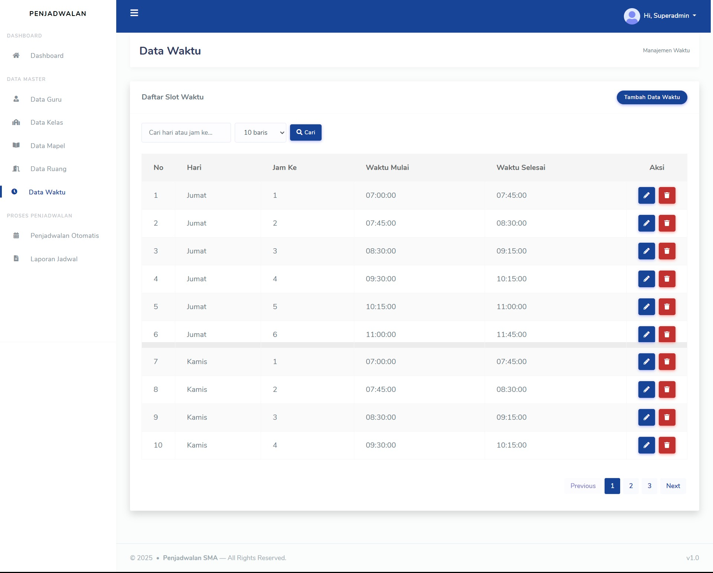
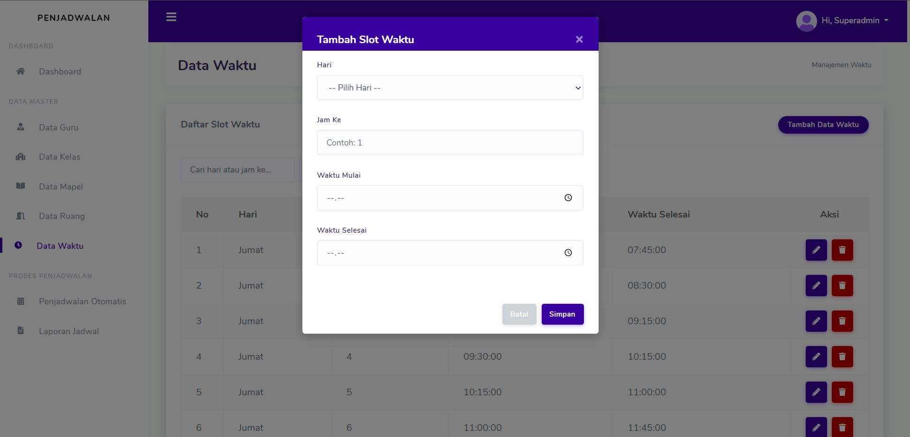
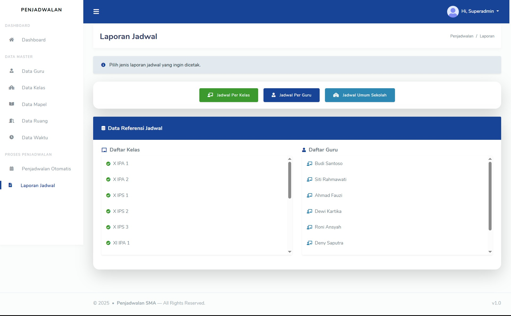

#  Sistem Penjadwalan Mata Pelajaran Menggunakan Algoritma Genetika dan Pencarian Cepat

Aplikasi ini dikembangkan menggunakan **Laravel** untuk membantu proses **penjadwalan mata pelajaran** secara otomatis pada tingkat sekolah.  
Proyek ini menerapkan **Algoritma Genetika** untuk menghasilkan jadwal yang optimal dan efisien, serta **pencarian cepat** untuk mempercepat proses seleksi dan pengecekan bentrok jadwal.

Aplikasi ini dapat digunakan untuk:
- Penjadwalan otomatis berdasarkan jam, guru, kelas, dan mata pelajaran  
- Mendeteksi bentrok secara real-time  
- Menghasilkan laporan jadwal dalam bentuk tabel dan cetak  

---

##  📸 Cuplikan Tampilan Aplikasi

Berikut adalah dokumentasi tampilan fitur-fitur utama aplikasi:

| No | Halaman | Cuplikan |
|----|---------|----------|
| 1 | Login |  |
| 2 | Dashboard |  |
| 3 | Data Guru |  |
| 4 | Tambah Guru |  |
| 5 | Edit Guru |  |
| 6 | Data Kelas |  |
| 7 | Tambah Kelas |  |
| 8 | Edit Kelas |  |
| 9 | Data Mata Pelajaran |  |
| 10 | Tambah Mata Pelajaran |  |
| 11 | Edit Mata Pelajaran |  |
| 12 | Data Ruang |  |
| 13 | Tambah Ruang |  |
| 14 | Edit Ruang |  |
| 15 | Data Waktu |  |
| 16 | Tambah Waktu |  |
| 17 | Edit Waktu |  |
| 18 | Proses Penjadwalan |  |
| 19 | Hasil Jadwal |  |
| 20 | Laporan Jadwal |  |

---

## 🔒 Akses Source Code

Kode sumber **tidak dipublikasikan secara umum**.  
Untuk mendapatkan akses penuh terhadap source code aplikasi ini, silakan hubungi:

📞 **+62 85849604654 (Roni)**  
📧 **ronn.7ex@gmail.com**

---

## 🛠️ Teknologi yang Digunakan

- **Laravel (PHP)**
- **MySQL Database**
- **Bootstrap 5**
- **Stisla Admin Template**
- **Algoritma Genetika**
- **Fast Search / Pencarian Cepat**
- **Export PDF & Print Tools**

---

## 🧬 Tentang Algoritma Genetika dalam Penjadwalan

Algoritma Genetika digunakan untuk menghasilkan jadwal optimal dengan mekanisme:

- **Inisialisasi populasi jadwal**
- **Seleksi berdasarkan nilai fitness (jumlah bentrok minim)**
- **Crossover untuk menggabungkan gen (jadwal) terbaik**
- **Mutasi untuk variasi solusi**
- **Iterasi hingga menemukan jadwal terbaik**

Metode ini sangat efektif untuk permasalahan penjadwalan kompleks seperti:

✔ Banyak guru  
✔ Banyak kelas  
✔ Banyak mata pelajaran  
✔ Banyak sesi waktu  

Hasil akhirnya berupa jadwal yang **minim bentrok**, **terdistribusi merata**, dan **mudah dibaca**.

---

## 👨‍💻 Pengembang

Dikembangkan oleh: **Roni, S.Kom**  
Tahun: **2025**  
Proyek ini dibuat untuk mendukung sistem pendidikan dalam manajemen penjadwalan yang lebih cepat, akurat, dan otomatis.

---

© 2025 – Sistem Penjadwalan Mata Pelajaran Menggunakan Algoritma Genetika  
Seluruh hak cipta dilindungi.
